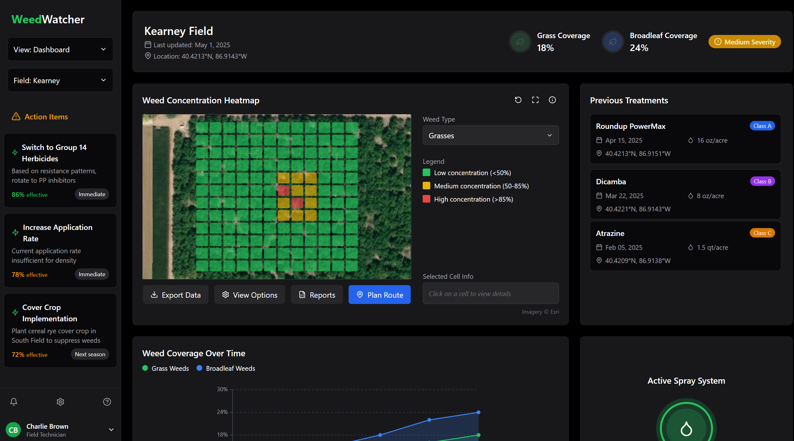

# WeedTrackr: Precision Weed Management System

1st Place Winner - 2025 AIFS × Sony AI AgTech Challenge

## 🌱 The Problem We're Solving

Weed management is a critical challenge facing modern agriculture, with profound economic and environmental implications:

- **$33 billion** in annual U.S. crop yield losses due to weed competition
- **$6 billion** in additional control measure costs each year
- **70 million pounds** of herbicides wasted through imprecise application
- Conventional methods rely on blanket treatments, applying uniform chemical amounts regardless of actual weed distribution
- Precision equipment exists but is expensive and designed primarily for row crops
- In vineyards and orchards, mowing between rows is common, but weeds along rows remain problematic

## 🚜 Our Solution: WeedTrackr

WeedTrackr is a low-cost AI weed-monitoring system designed specifically for planning herbicide sprays in orchards and vineyards that:

- **Automates weed scouting** during regular maintenance activities
- **Creates precision spray maps** based on actual weed distribution
- **Reduces herbicide use** by up to 90% through targeted application
- **Minimizes environmental impact** and promotes sustainable farming
- **Saves time and money** by eliminating manual scouting and reducing chemical use
- **Works passively** alongside existing maintenance procedures

## 🔍 How It Works

### Simple 3-Step Process

1. **Mount** WeedTrackr onto your mower or tractor
2. **Power on** the image-collection system
3. **Continue with normal activities** — WeedTrackr works autonomously in the background

### Technical Workflow

#### Detect → Classify → Plan

- **Detect:** WeedTrackr uses a Raspberry Pi with the AI-enabled camera and Spresense GPS module to capture geolocated images as you move through your field
- **Classify:** The onboard AI model processes images in real-time to identify and categorize weeds (broadleaf vs. grass) and distinguish them from soil
- **Plan:** The WeedTrackr dashboard generates intelligent spray route planning and application maps based on weed density and distribution

## 🧠 Machine Learning Model

Our custom weed classification model is built on a modified MobileNetV2 architecture, optimized for edge deployment.

### Model Architecture

We use two model architectures:
- **WeedNet (Primary)**: Modified MobileNetV2 optimized for low-power edge devices
- **Tiny ResViT (Experimental)**: Hybrid ResNet-Vision Transformer for improved accuracy

### Dataset

Our model is trained on a diverse dataset consisting of:
- **500+** images of broadleaf weeds
- **500+** images of grass weeds
- **1,000+** images of soil and background scenes

All images are augmented with various transformations to improve model robustness:
- Random crops and rotations
- Horizontal and vertical flips
- Brightness, contrast, and color adjustments
- Gaussian blur

### Performance Metrics

| Metric | Value |
|--------|-------|
| Accuracy | 94.2% |
| Inference Time | 35ms (IMX500) |

## 🔧 Hardware Configuration

WeedTrackr combines affordable, off-the-shelf components with custom integration software:

### Core Components

- **Raspberry Pi Zero + AI Camera** for system control, data management, and vision
- **Sony Spresense** GPS module for precise geolocation

## 💻 Software Architecture

WeedTrackr's software stack consists of three main components:

### 1. Edge AI System (Raspberry Pi + IMX500)

The edge component runs directly on the device mounted to farm equipment and handles:

- Real-time image capture and preprocessing
- On-device weed classification using the optimized model
- GPS data integration and geolocation tagging

### 2. Web Dashboard (React + TypeScript)

The frontend dashboard provides farmers with:

- Intuitive visualization of weed distribution across fields
- Precision spray planning with estimated chemical savings
- Historical treatment records and effectiveness tracking
- Recommendations for herbicide selection based on weed types



## 🔄 Model Optimization for Edge Deployment

Converting our trained PyTorch model to run efficiently on the camera sensor requires several optimization steps:

1. **Training in PyTorch** with MobileNetV2 architecture
2. **Quantization** to reduce model size and improve inference speed
   - Post-training quantization using MCT (Model Compression Toolkit)
   - INT8 precision for weights and activations
3. **ONNX Conversion** for hardware compatibility
4. **IMX500 Packaging** for deployment on the intelligent vision sensor

```
# Model conversion workflow
Python Model (PyTorch) → MCT Quantization → ONNX → IMX500 Package (.rpk)
```

This optimization pipeline reduces the model size by 75% while maintaining over 93% of the original accuracy.

## 📊 Dashboard Features

The WeedTrackr dashboard provides comprehensive insights and management tools:

### Field Overview

- At-a-glance summary of weed pressure across fields
- Latest data collection timestamps and coverage statistics
- Field severity ratings for prioritizing treatment

### Weed Distribution Heat Maps

- GPS-accurate visualization of weed concentration
- Separate views for grass and broadleaf weeds
- Zoom and filter capabilities for detailed analysis

### Treatment Planning

- Automated spray route generation
- Variable rate application maps
- Chemical usage and cost projections
- Estimated savings compared to blanket treatment

### Historical Analysis

- Weed pressure trends over time
- Treatment effectiveness tracking
- Seasonal patterns and forecasting

## Why Now & Future Vision

WeedTrackr addresses critical emerging needs in agriculture:

- Increasing regulatory pressure on herbicide use
- Rising costs of agricultural chemicals and labor
- Growing consumer demand for sustainable farming practices
- Recent advances in AI and edge computing making precision agriculture more accessible

Our roadmap includes:
- Integration with existing spray equipment for automated application
- Expanded weed identification capabilities (25+ species)
- Drone-based deployment option for larger operations
- Predictive analytics for preventative weed management

## 🚀 Getting Started

### How to make a model running on RaspberryPi?
1. Install dependencies
```
conda install openjdk
```

2. Train a model
```bash
python model_development/train.py
```

3. Quantize model uisng mct_quantize
```
python model_development/converter_scripts/mct_convert.py --model-path output/run_20250503_170330/best_model.pth
```


4. Convert model using imxconv-pt
```bash
imxconv-pt -i model_development/optimized_models_mct/mct_quantized_model.onnx -o model_development/optimized_models_mct/output
```
Copy the converted zip file to raspberry pi

5. On Raspberry pi run
```
imx500-package -i output_rpi/packerOut.zip -o output_rpi
```

### Software Setup

1. Clone this repository:
```bash
git clone https://github.com/nathanchiu888/weedtrackr.git
```

2. Set up the Raspberry Pi environment:
```bash
cd model_development
pip install -r requirements.txt
```

3. Launch the dashboard:
```bash
cd app
npm install
npm run dev
```

WeedTrackr — Weed vigilance and precision management.  
*2025 AIFS × Sony AI AgTech Challenge*